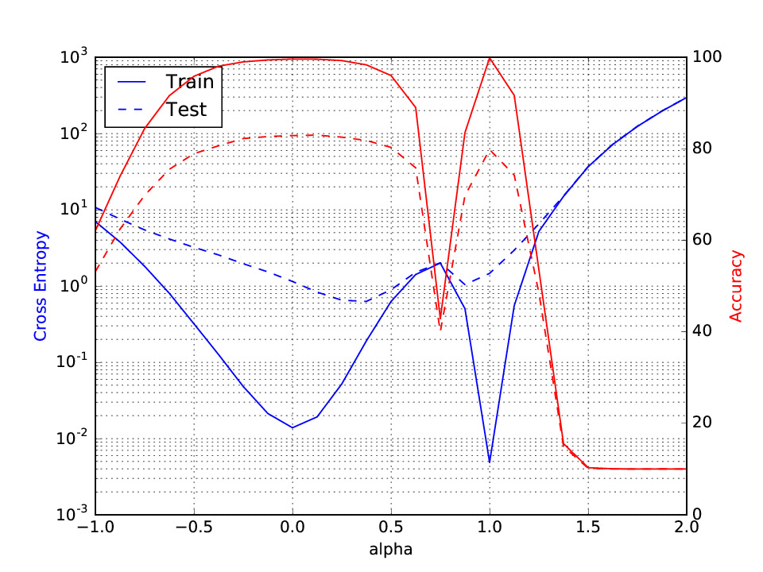

# On Large-Batch Training for Deep Learning: Generalization Gap and Sharp Minima
by Nitish Shirish Keskar, Dheevatsa Mudigere, Jorge Nocedal, Mikhail Smelyanskiy and Peter Tang

Paper link: [arXiv preprint](https://arxiv.org/abs/1609.04836)

### Introduction
This is a WIP code of a PyTorch implemenation of some of our experiments. We include a sample file `plot_parametric_pytorch.py` which trains a VGG11 model (somewhat like `C3` in the paper) with LB and SB Adam and plots the parametric plot. Changing the model, optimizer, or plotting frequency should be fairly straightforward. There are some TODO items which are included in the prefacing comments of `plot_parametric_pytorch.py`.  
	
### Usage
Just as before, to reproduce the parametric plots, you only need the two Python files (`plot_parametric_pytorch.py` and `vgg.py`). The latter contains the model configurations for the VGG-family of networks; the former trains the model imported from `vgg` using the SB and LB methods and plots the parametric plot connecting the two minimizers.

	python plot_parametric_pytorch.py 

The generated figure should resemble:

	
