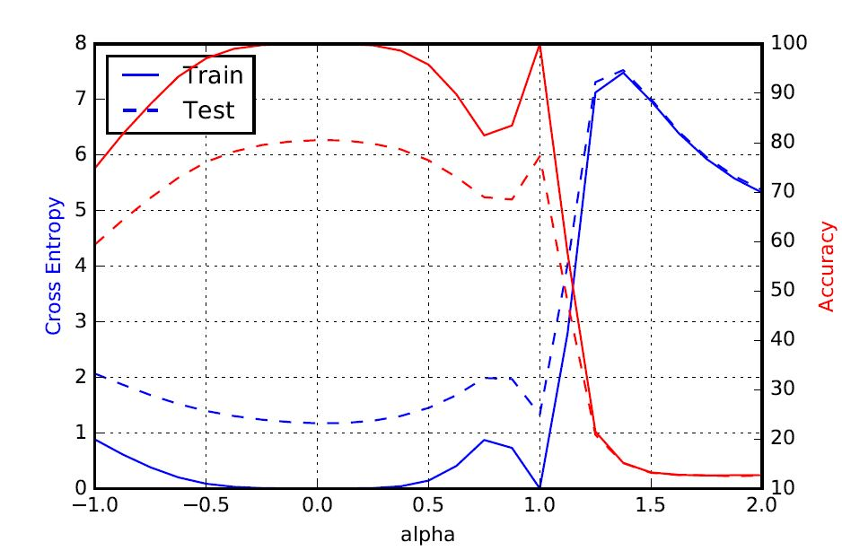

# On Large-Batch Training for Deep Learning: Generalization Gap and Sharp Minima
by Nitish Shirish Keskar, Dheevatsa Mudigere, Jorge Nocedal, Mikhail Smelyanskiy and Peter Tang

Paper link: [arXiv preprint](https://arxiv.org/abs/1609.04836)
### Table of Contents
0. [Introduction](#introduction)
0. [Citation](#citation)
0. [Disclaimer and Known Issues](#disclaimer-and-known-issues)
0. [Usage](#usage)

### Update (April 24)
Our code was written in Keras 1.X, there have been a lot of API changes in Keras 2.X which have broken our code. We're working on updating our code to support Keras 2.X but in the meantime, provide a preliminary PyTorch implementation (refer to the PyTorch folder for details). As always, we welcome any questions, suggestions, requests or bug-reports. 

### Introduction

This repository contains (Python) code needed to reproduce some of the figures in our [paper](https://arxiv.org/abs/1609.04836). The plots illustrate the relative _sharpness_ of the minima obtained when trained using small-batch (SB) and large-batch (LB) methods. For ease of exposition, we use a Keras/Theano setup but owing to the simplicity of the code, translating the code into other frameworks should be easy. Please contact us if you have any questions, suggestions, requests or bug-reports.

### Citation

If you use this code or our results in your research, please cite:

	@article{Keskar2016,
		author = {Nitish Shirish Keskar, Dheevatsa Mudigere, Jorge Nocedal, Mikhail Smelyanskiy and Ping Tak Peter Tang},
		title = {On Large-Batch Training for Deep Learning: Generalization Gap and Sharp Minima},
		journal = {arXiv preprint arXiv:1609.04836},
		year = {2016}
	}

### Disclaimer and Known Issues

0. In the included code, we use Theano/Keras to train the networks C1 - C4 using a batch size of 256 (for SB) and using 5000 (for LB). Depending on your hardware (especially if using GPUs), you may run into memory issues when training using larger batch sizes. If this happens, you can either train using a different setup (such as CPUs with large host-memory) or adapt our code to enable multi-GPU training. 
1. The code for computing the _sharpness_ of a minima (Metric 2.1) will be released soon. As is the case with the parametric plots, the code is quite straightforward. The code in Keras' pull-request [#3064](https://github.com/fchollet/keras/pull/3064) along with SciPy's [L-BFGS-B](http://docs.scipy.org/doc/scipy/reference/generated/scipy.optimize.fmin_l_bfgs_b.html#scipy.optimize.fmin_l_bfgs_b) optimizer can be used in conjunction to compute the values easily. 

	
### Usage
To reproduce the parametric plots, you only need the two Python files (`plot_parametric_plot.py` and `network_zoo.py`). The latter contains the model configurations for the C1-C4 networks; the former trains the model imported from `network_zoo` using the SB and LB methods and plots the parametric plot connecting the two minimizers. The network is chosen using a command-line argument `-n` (or `--network`) and the generated plot is saved in PDF form. For instance, to plot for the C1 network, one can simply run:

	KERAS_BACKEND=theano python plot_parametric_plot.py -n C1

with the necessary Theano flags depending on the setup. The figure in the `Figures/` folder should resemble:

	
